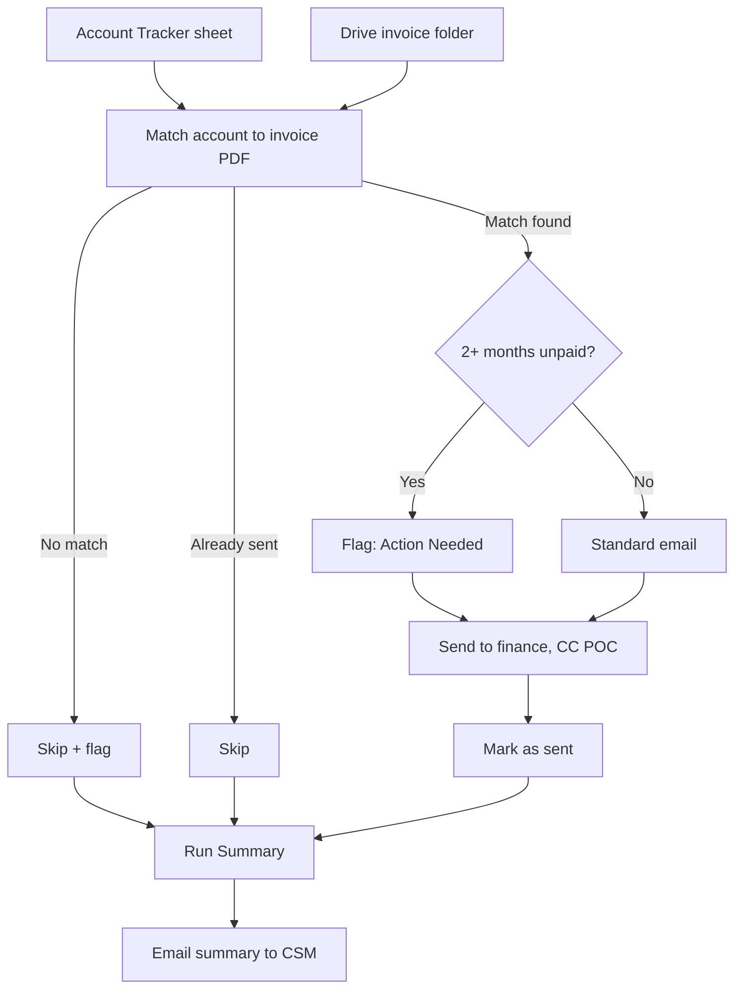

To get started - https://auto-invoice-mailer.netlify.app/

# Monthly Invoice Automation

Automates the monthly invoice send-out: matches each account to its invoice PDF, sends it to the right finance contact, flags overdue accounts, and emails a summary when done. Runs entirely on your own Google account (Sheets, Drive, Gmail) — no company backend involved.

Built to remove a repetitive manual task without needing IT access or engineering resources, using only a spreadsheet you own.

## Where this fits

A working example of spotting a real inefficiency and shipping a fix for it — not just proposing one. Same pattern is repeatable by any CSM, for their own book, without needing engineering support.

## Is this "AI"?

Mostly no. Matching, routing, and flagging are all rule-based — predictable and auditable, which matters with real money and customers. AI was used to *build* this, not to run it. Details in `docs/Invoice_Automation_Project.docx`.

## How it works

1. Reads accounts from a Google Sheet
2. Matches each to its invoice PDF in Drive, by account ID
3. Flags accounts with 2+ unpaid months
4. Sends the email — to finance, CC's the POC, PDF attached
5. Marks it as sent (safe to re-run — already-billed accounts are skipped)
6. Emails you a summary — sent, skipped, totals, month-over-month change

Trigger it manually in n8n, on a schedule, or via the button in `index.html`.



## What's in this repo

```
/
├── index.html                                → click-to-run trigger page
├── workflow/
│   └── Monthly_Invoice_Automation.n8n.json   → import into n8n
├── sample-data/
│   ├── account_tracker_sample.csv            → required columns, 2 example rows
│   └── invoices_sample.zip                   → sample PDFs for testing
└── docs/
    ├── Invoice_Automation_Project.docx
    ├── n8n_Invoice_Automation_Setup_Notes.docx
    └── Changing_Sheet_Or_Folder_Guide.docx
```

## Setup

1. Create a Google Sheet using the columns in `account_tracker_sample.csv`
2. Upload invoice PDFs to Drive — filenames must contain each row's `account_id`
3. Import `Monthly_Invoice_Automation.n8n.json` into n8n
4. Connect Google Sheets, Drive, and Gmail credentials on the relevant nodes
5. Point those nodes at your actual sheet and folder
6. Publish the workflow (required for the trigger to work)
7. Deploy `index.html` and update its `WEBHOOK_URL` to match

Full detail: `docs/n8n_Invoice_Automation_Setup_Notes.docx`
